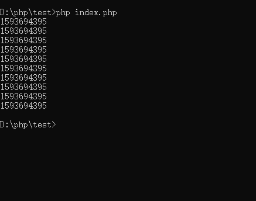
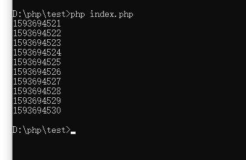

# PHP问题总结

## thinkPHP中的模型关联

**模型关联知识梳理：**

* 意义：通过模型关联把数据表的关联关系对象化，解决了大部分的常用的关联场景，比操作常规的数据库更加智能和高效、直观。

> 避免了在模型内部使用复杂的`join`查询和视图查询。

### 模型中的一对一关联

* 定义一个关联模型如`User`
* `hasOne`方法的参数包括：

> `hasOne('关联模型类名','外键','主键');`
>
> * 关联模型（必须）：关联模型的类名
>
> * 外键：默认是关联模型的类名小写+`_id`，如`user_id`
> * 主键：当前模型的主键，默认自动获取也可以指定传入

* 外键和主键并不一定是真实的外键和主键，但是要保证其的关联关系，用索引来代替外键，提高查询的效率。

```php
<?php
    namespace app\model;
	use think\Model;
	class User extend Model{
        public function userinfo(){
            return $this->hasOne('Userinfo');
        }
    }
```

* 定义一个被关联的空模型`Userinfo`

```php
<?php
    namespace app\model;
	use think\Model;
	class Userinfo extend Model{
        
    }
```

* 使用方法

```php
<?php
	namespace app\controller\Index;
	use app\model\User;
	class Index {
        public function index(User $user){
            $user1 = $user->find(1);
            echo $user1->userinfo->nickname;
        }
    }

```

### 相对关联1对1

> 相对关联类似于附表关联主表的操作
>
> `belongsTo('关联模型','外键','关联主键');`
>
> * 关联模型(必须)：关联模型的类名
> * 外键：当前模型外键，默认的外键名贵族是关联模型名+`_id`
> * 关联主键：关联模型主键，一般可以自动获取对应主键，也可以自己传入。

```php
<?php
    namespace app\model;
	use think\Model;
	class Userinfo extend Model{
        public function user(){
            return $this->belongsTo(User);
        }
    }
```

**在定义关联查询的时候不能使用以下的几种方式进行关联操作**

```php
return $this->hasOne('Userinfo')->order('create_time');
return $this->hasOne('Userinfo')->select();
return $this->hasOne('Userinfo')->sum();
return $this->hasOne('Userinfo')->count();
```

> 以上仅为列举的一类还有其他一些较为重要的复合函数均不能使用

### 解决`N+1`次查询问题

> 使用与载入查询的方法可以解决典型的`N+1`次查询问题，使用：

```php
$users = User::with('userinfo')->select();
foreach($users as $user){
    echo $user->profile->name;
}
```

> 以上代码使用的是`IN`查询，只会产生2条`SQL`查询语句。

* 如果要对关联模型进行约束，可以采用闭包的方式。
* `with`方法可以传入数组或同事关联多个模型（支持不同的关联类型）进行与载入查询。
* 如果需要使用`JOIN`方式查询，直接可以使用`withJoin`方法，这样只会生成一条语句。默认连接方式是`INNER JOIN`。

### 关联保存

```php
$user = User::find(1);
$user->userinfo()->save(['nickname'=>'测试']);
```

### 定义别名

```php
public function userinfo(){
    return $this->hasOne('Profile','user_id')->bind([
        'email',
        'name'=>'nickname'
    ]);
}
```

### 使用

```php 
$user = User::with('profile')->find(1);
// 直接输出关联模型的绑定属性
echo $user->email;
echo $user->name;
```

::: warning 注意点：

`with`方法只能调用一次，不能多次调用

:::

### 一对多关联

> `hasMany('关联模型','外键','主键')`;
>
> 操作基本同上

### 多对多关联

> 需要建立一个中间表进行关联操作
>
> `belongsToMany('关联模型','中间表','外键','关联键')`；
>
> * 关联模型（必须）：关联模型类名
> * 中间表：默认规则是当前模型名+`_`+关联模型名（可以自己指定模型名）
> * 外键：中间表的模型外键，默认是关联模型名称+`_id`
> * 关联键：中间表的当前模型关联键名，默认规则是当前模型+`_id`

### 模型关联闭包中的操作

> 在使用闭包查询的时候，如果需要对关联表做查询或者限制表字段的操作，需要通过下面的方式

```php

 $query->getQuery()->field("表名.表字段")->where("表名.表字段","值");
 
```

## thinkPHP伪静态配置

### Apache

1. `httpd.conf`配置文件中加载了`mod_rewrite.so`模块
2. `AllowOverride None`将`None`改为`All`
3. 把下面的内容保存为`.htaccess`文件放到应用入口文件的同级目录下

```
<IfModule mod_rewrite.c>
  Options +FollowSymlinks -Multiviews
  RewriteEngine On

  RewriteCond %{REQUEST_FILENAME} !-d
  RewriteCond %{REQUEST_FILENAME} !-f
  RewriteRule ^(.*)$ index.php/$1 [QSA,PT,L]
</IfModule>
```

**若不生效则使用以下的方法：**

```
// 将
RewriteRule ^(.*)$ index.php/$1 [QSA,PT,L]
// 改为
RewriteRule ^(.*)$ index.php?/$1[QSA,PT,L]
```

### Nginx

在`Nginx`低版本中，不支持`PATHINFO`的，但是可以通过在`Nginx.conf`中配置转发规则实现：

```
location / { // …..省略部分代码
   if (!-e $request_filename) {
   		rewrite  ^(.*)$  /index.php?s=/$1  last;
    }
}
```

***若应用配置在二级目录中需要设置对应的`Nginx`的伪静态方法***

> 例如当前有一个项目的目录名称为`myproject`的二级目录

```
location /`myproject`/ {
    if (!-e $request_filename){
        rewrite  ^/`myproject`/(.*)$  /`myproject`/index.php?s=/$1  last;
    }
}
```

### IIS(不推荐)

如果你的服务器环境支持`ISAPI_Rewrite`的话，可以配置`httpd.ini`文件，添加下面的内容：

```
RewriteRule (.*)$ /index\.php\?s=$1 [I]
```

在IIS的高版本下面可以配置`web.Config`，在中间添加`rewrite`节点：

```
<rewrite>
 <rules>
 <rule name="OrgPage" stopProcessing="true">
 <match url="^(.*)$" />
 <conditions logicalGrouping="MatchAll">
 <add input="{HTTP_HOST}" pattern="^(.*)$" />
 <add input="{REQUEST_FILENAME}" matchType="IsFile" negate="true" />
 <add input="{REQUEST_FILENAME}" matchType="IsDirectory" negate="true" />
 </conditions>
 <action type="Rewrite" url="index.php/{R:1}" />
 </rule>
 </rules>
 </rewrite>
```

## `php`中`yield`的用法

### 解决的问题

> 解决运行内存的瓶颈，`php`程序中的变量存储在内存中，大批量的数据写入内存后会导致内存不足出现错误`Fatal Error: Allowed memory size of xxxxxx bytes `
>
> 所以一般通过设置`php`最大运行内存`ini_set('memory_limit','300M')`
>
> 但是当我们读取几个G大的文件的时候，我们运行内存可能就吃不消了，所以我们一般会选择使用`yield`

### 对比

#### 非采用yield

```php
<?php
function createArr($num){
	$data = [];
	for($i=0;$i<$num;$i++){
		$data[] = time();
	}
	return $data;
}
$data = createArr(10);
foreach($data as $val){
	echo $val.PHP_EOL;
	sleep(1);
}
```

运行后：

<a data-fancybox title="image-20200702205402889" href="./image-20200702205402889.png"></a>

> 可以看到时间戳都是相同的

#### 采用yield

```php
<?php
function createArr($num){
	for($i=0;$i<$num;$i++){
		yield time();
	}
}
$data = createArr(10);
foreach($data as $val){
	echo $val.PHP_EOL;
	sleep(1);
}
```

<a data-fancybox title="使用Yield" href="./image-20200702205542213.png"></a>

> 可以看到每次输出的时间都相隔1秒，通过这个例子我们可以知道，不是像不采用yield方式把for循环中的内容存在内存中，而是一个个的消耗。

[PHP性能优化](https://segmentfault.com/a/1190000012334856 "PHP性能优化")

## composer忽略扩展检查

```shell script
composer --ignore-platform-reqs require  扩展名称
```
