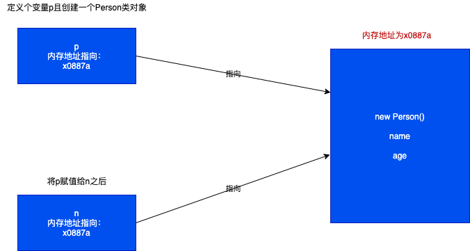

# DOM

* 什么是window？

window对象是一个全局的对象，代表浏览器中一个打开的窗口，每一个窗口都是一个window对象

* 什么是document？

document是window的一个属性，这个属性是一个对象

document：代表当前窗口中的整个网页，通过document对象我们就可以操作整个网页上的所有内容

* 什么是DOM？

DOM定义了访问和操作HTML文档的标准方法

DOM全称：Document Object Model ，即文档模型对象

所以学习DOM就是学习如何通过document对象操作网页上的内容

## 获取DOM元素

### 通过id获取指定的元素

```js

let ref = document.getElementById('元素的id名称')

```

返回的是一个对象

### 通过class获取指定的元素

```js

let refs =  document.getElementsByClassName('类名称')

```

返回的是一个伪数组

### 通过name获取指定元素

```js

let refs = document.getElementsByName('元素的name名称')

```

返回的也是一个伪数组

### 通过标签名称获取

```js

let refs = document.getElementsByTagName('标签名称')

```

返回的是一个伪数组

### 通过选择器获取(重点)

选择器指的是`css`中选择器，例如：`#box,.father`等等

```js

let ref = document.querySelector("选择器名称")

```

这种方式无论使用的什么选择器，都只会返回一个节点，如果需要多个元素的返回值，需要使用如下的方法

```js

let refs = document.querySelectorAll("选择器名称")

```

返回所有的匹配的元素信息

### 获取父级元素下面的子元素

```html

<div>
    <h1>2</h1>
    <h2>3</h2>
</div>

```

```js

// 首先获取到当前的父节点

let father = document.querySelector("div")

// 获取子元素方式1

// 这种方式拿到的是指定元素中所有的子元素
let childern = father.children

// 获取子元素方式2
// 这种方式拿到的是指定元素中所有的子节点信息,
// 什么是节点?
// DOM对象，这个对象以树的形式保存了界面上所有的内容，因为在html代码中出现了换行也是一种节点信息，其节点为text类型，所以上面的节点会返回我们5个节点信息
let childNodes = father.childNodes
// [text,h1,text,h2,text]
// 只获取我们需要的节点信息，我们需要的只有h1和h2子元素
for(let node of childNodes){
    if(node.nodeType === Node.ELEMENT_NONE){
        console.log(node)
    }
}

// 通过指定的节点中的第一个子节点
father.firstChild

// 获取指定元素中的第一个子元素
father.firstElementChild

// 获取最后一个子节点
father.lastChild

// 获取最后一个子元素
father.lastElementChild

```

### 通过子元素获取父元素

```html

<div>
    <p class="item1"></p>
    <p class="item"></p>
    <p class="item2"></p>
</div>

```

```js

// 拿到子元素
let item = document.querySelector(".item")

// 拿到父元素
item.parentElement

// 拿到父节点
item.parentNode

// 为什么会出现两种写法? 因为在早之前的火狐浏览器不支持parentElement

// 兼容写法
let parentEle = item.parentElement || item.parentNode


// 获取相邻上一个节点，item的上一个节点是text
item.previousSibling

// 获取相邻上一个元素，item的上一个节点是item1
item.previousElementSibling

// 获取相邻的下一个节点 同样是text
item.nextSibling

// 相邻的下一个子元素
item.nextElementSibling

```

## 节点的增删改查

```html

<div>
    <h1>我是标题</h1>
    <p>我是段落</p>
</div>

```

```js

// 创建节点
let oSpan = document.createElement('span')
// 返回的是一个对象
let oDiv = document.querySelector("div")
// 将span标签添加到div节点的最后面
oDiv.appendChild(oSpan)
// appendChild会将指定的元素添加到最后

// 插入节点
let oH1 = document.querySelector('h1')
oDiv.insertBefore(oSpan,oH1)
// 删除节点
// 通过父元素，删除指定的子元素
oSpan.parentNode.removeChild(oSpan)
// 通过父元素body，删除指定的div子元素
oDiv.parentNode.removeChild(oDiv)
// 元素是不能够自杀的，只能通过父元素删除子元素

// 克隆节点
// 当前只会克隆父元素，如果需要克隆子元素需要给一个true
let newDiv = oDiv.cloneNode(true)

```

## 元素属性的增删改查

无论是通过document创建还是查询出来的标签，系统都会将元素包装成一个对象返回给我们，
系统在包装这个对象的时候会自动将元素的属性都包装在这个对象中，所以只要拿到这个对象就可以拿到标签属性，操作做标签属性

```html



```

```js

let oImg = document.querySelector('img')

// 1. 获取元素的属性
console.log(oImg.alt);
// 自定义属性只能通过下面的方式获取
console.log(oImg.getAttribute('age'))

// 2. 修改元素属性的取值
oImg.title = "新的title"
// 自定义属性只能通过下面的方式修改
oImg.setAttribute('age','122')

// 3. 新增元素属性
// setAttribute如果属性不存在就是新增，如果属性存在就是修改
oImg.setAttribute('info','12121')

// 4. 删除元素属性
// 这种方式只能清空自带的属性
oImg.alt = "";
// 这种方式可删除自定义的属性
oImg.removeAttribute('age')

```

## 操作元素中的内容

```html
<div>
    我是div
    <h1>我是标题</h1>
    <p>我是段落</p>
</div>

```

```js
// 1. 获取元素内容
let oDiv = document.querySelector('div')
// 只有文本,会去掉空格
console.log(oDiv.innerText);
// 包含标签，并且不会去除空格
console.log(oDiv.innerHTML);
// 只有文本，并且不会去除空格
console.log(oDiv.textContent);

// 2. 设置元素内容
// 特点：无论通过下面的那种方式设置内容，新的内容都会覆盖原有的内容

// 如果设置的数据中包含标签，会转成标签
oDiv.innerHTML = "123"
// 如果设置的数据中包含标签，会将标签当成字符串
oDiv.innerText = "456"
// 如果设置的数据中包含标签，会将标签当成字符串
oDiv.textContent = "789"

// innerText和textContent是需要结合起来用的，因为有的浏览器不支持

setText(oDiv,"test")

function setText(obj,text) {
    if ('textContent' in obj){
        obj.textContent = text
    }else {
        obj.innerText = text
    }
}
```

## 操作元素的样式

```html
<style>
    .box{
        width: 200px;
        height: 200px;
        background-color: red;
    }
</style>


<div></div>

```

```js
// 设置元素的样式
let oDiv = document.querySelector('div')
// 绑定类名
oDiv.className = 'box'
// 通过js直接操作
// 注意：过去css中通过-链接的样式，全部使用驼峰的方式命名
// 通过js添加的样式都是行内样式，会覆盖掉同名的CSS样式
oDiv.style.width = '300px'
oDiv.style.height = '300px'
oDiv.style.backgroundColor = 'blue'
// 获取元素的样式
// 只能够获取到行内样式的值，不能获取到通过类名设置的属性值
console.log(oDiv.style.width);
// 如果需要获取到当前的属性值
// 如果想获取到css设置的属性值，必须通过getComputedStyle方法来获取
// 其接受一个参数，这个参数就是要获取的元素对象，其会返回一个对象，这个对象中保存了CSS设置的样式和属性值
let style = window.getComputedStyle(oDiv)
console.log(style.width);
```

## 点击事件

用户和浏览器之间的交互行为，我们就称之为事件，比如：点击，移入/移出

如何给元素绑定事件

在JavaScript中所有的HTML标签都可以添加事件

```js

元素.事件名称 = function(){
}
```
当对应的时间背触发时候，就会自动执行`function`中的代码

```html

<button>我是按钮</button>
<a href="http://www.28yanyu.cn">我是A标签</a>
```

```js

let oBtn = document.querySelector('button')

// 单击事件
oBtn.onclick = function (ev) { 
    alert("按钮被点击了")
}

let oA = document.querySelector('a')
// 如果给元素设置了和系统同名的事件，我们添加的事件不会被覆盖系统添加的事件
oA.onclick = function (ev) { 
    alert("A标签被点击了")
    // 用我们添加的事件，覆盖掉系统同名的事件
    return false;
}
```

## 定时器

在JS中存在两种定时器，一种是重复执行的定时器，一种是只执行一次的定时器

```js

// 重复执行

let inter = setInterval(function () {
    console.log("重复执行");
    // 清除定时器
    clearInterval(inter)
},1000)


// 只执行一次

let timer = setTimeout(function () {
    console.log("只执行一次")
    clearTimeout(timer)
},1000)
```

## 闭包

### 什么是闭包

闭包是一种特殊的函数

### 如何生成一个闭包

当一个内部函数引用了外部函数的数据（变量/函数）时，那么内部的函数就是闭包，所以只要满足"是函数嵌套"、"内部函数引用外部函数数据"

### 闭包特点

只要闭包还在使用外部函数的数据，那么外部的数据就一直不会被释放，也就是说可以延长外部函数数据的生命周期

```js

function test() {
    var i = 666; //局部变量
} // 只要代码执行到大括号结束，i就会被自动释放

```

```js

function test() {
    var i = 777;
    // 由于demo满足闭包的两个条件，所以demo函数就是闭包
    return function demo(){
        console.log(i)
    }
}

let fn = test()

fn() // 777
```

::: warning 注意点：

当后续不需要使用闭包时候，一定要手动将闭包设置为null，否则会造成内存泄露

:::

## 循环索引同步

默认情况下循序结构，代码会从上至下执行，前面的没执行完后面的不能执行，

默认情况下var定义的变量，只要不是定义在函数中都是全局变量

```js

for (var i = 0; i < 3; i++) {
    function test() {
        console.log(i) // 3
    }
}
console.log(i) // 3
test()

```

```js
for (var i = 0; i < 3; i++) {
    function test() {
        console.log(i) // 0 1 2
    }
    test() 
}

```

```js

for (var i = 0; i < 3; i++) {
    (function test() {
        console.log(i) // 0 1 2
    })()
}

```

```js

for (var i = 0; i < 3; i++) {
    (function test(index) {
        console.log(index); // 0 1 2
    })(i)
}

```

使用let定义变量

注意点：由于i是局部变量，所以每次执行完循环体都会重新定义一个i变量

```js
let list = []

// let在for循环中每次都会开启一个新的作用域

for (let i = 0; i < ; i++) {
    // 在ES6中由于{}是块级作用域，所以只要在块级作用域中定义了一个函数
    // 并且这个函数中用到了块级作用域中的数据，那么这个函数就是闭包
    let fn = function test() {
        console.log(i)
    }
}

list[0]() // 0
list[1]() // 1
list[2]() // 2
test() // 2
console.log(i) // 报错
```

## 排它思想

清除其他非选中元素的样式，只设置当前选中元素的样式

```html
<style>
    .current{
        background-color: red;
    }
</style>
<ul>
    <li class="current">我是第1个li</li>
    <li>我是第2个li</li>
    <li>我是第3个li</li>
    <li>我是第4个li</li>
    <li>我是第5个li</li>
</ul>

<script>
    let oItems = document.querySelectorAll('li')
    let index = 0;
    for (let i = 0; i < oItems.length; i++) {
        let item = oItems[i]
        item.onclick = function () {
            // 排他思想 方式1 ： 性能差
            // for (let j = 0; j < oItems.length; j++) {
            //     let li = oItems[j]
            //     li.className = ''
            // }
            // 只需要排除一个即可，不需要全部排除
            oItems[index].className = ''
            item.className = 'current'
            index = i
        }
    }
</script>

```

### 前端开发规范

* 如果id名称是由多个单词组成的，那么建议使用下划线来链接

* 如果class名称是由多个单词组成的，那么建议使用中划线来链接

### 箭头函数与普通函数的区别

* 普通函数/方法中的this，谁调用就是谁

* 箭头函数中的this，是父作用域的this，不是调用者

```js

function demo() {
    console.log(this) // window
}
// 在这里是window对象调用的当前的函数
demo()

let p = {
    name:'test',
    say:function () {
        console.log(this)
    },
    // 因为没有将箭头函数放到其他的函数中，所以箭头函数属于全局作用域
    // 在JS中只有定义一个新的函数才会开启一个新的作用域
    hi:()=>{
        console.log(this) // window
    }
}

p.say() // {name:'test',say:f}
p.hi() // window

function Person(){
    this.name = 'test'
    this.say = function () {
        console.log(this) // Person
    }
    // 因为将箭头函数放到其他的函数中，所以箭头函数属于其他函数（当前的其他函数就是构造函数）
    // 既然箭头函数属于构造函数，所以箭头函数中的this就是构造函数的this
    this.hi = ()=>{
        console.log(this) // Person
    }
}
```

注意点：

```js

function Person() {
    this.name = "test"
    this.say = function () {
        console.log(this) // {name:'zs'}
    }
    
    this.hi = ()=>{
        console.log(this) // Person
    }
}

let p = new Person()
// 修改成功
p.say.call({name:'zs'});
// 修改不成功，箭头函数永远指向的是他所属的作用域中的this，
// 通过call或者apply或者bind都是没办法修改的
p.hi.call({name:'zs'})

```

## 时间对象

### 获取当前时间

```js

let date = new Date()

// 返回当前时间
console.log(date);
// 返回毫秒值

console.log(Date.now());

```

### 创建指定时间

```js

let date = new Date('2019-11-11 09:08:07')
console.log(date)
// 月份要减一个月
let date1 = new Date(2019,10,11,9,8,7);
console.log(date1);

```

### 获取指定的时分秒

```js

let date = new Date()

console.log(date)

// 完整年份
console.log(date.getFullYear());
// 月份，默认一月是0所以手动要加1
console.log(date.getMonth()+1);
// 日期
console.log(date.getDate());
// 小时
console.log(date.getHours());
// 分钟
console.log(date.getMinutes());
// 秒
console.log(date.getSeconds());
// 毫秒
console.log(date.getMilliseconds());
```

### 时间格式化

```js

let date = new Date()

function formatDate(date) {
    return`${date.getFullYear()}-${date.getMonth()+1}-${date.getDate()} ${date.getHours()}:${date.getMinutes()}:${date.getSeconds()}`
}

console.log(formatDate(date));

```

## 事件

### 添加事件的三种方式


```html
<button id="btn">我是按钮</button>
<script>
    // 第一种方式
    // 给通一个元素添加多个事件会被覆盖掉
    let oBtn = document.getElementById('btn')
    oBtn.onclick = function () {
        alert("111")
    }
    // 第二种方式
    // 注意点：给同一个元素多次添加一个事件，不会被覆盖，只支持IE9以上的浏览器
    oBtn.addEventListener('click',function () {
        alert("222")
    })
    // 第三种方式
    // 仅支持低版本的浏览器IE9以下
    // oBtn.attachEvent('onclick',function () {
    //     alert("333")
    // })
    function addEvent(ele,name,fn){
        if (ele.attachEvent){
            ele.attachEvent('on'+name,fn)
        }else {
            ele.addEventListener(name,fn)
        }
    }
</script>

```

### 事件对象

事件对象就是一个系统自动创建的一个对象，
当注册的时间被触发的时候，系统会自动创建事件对象

```html

<button id="btn"></button>
<a href="http://www.28yanyu.cn">烟雨</a>
<script>
    let oBtn = document.getElementById('btn')
    // 默认在高级浏览器中是可以触发，但是在低级版本的浏览器当中，就无法拿到，需要做兼容处理
    oBtn.onclick = function (e){
        // 兼容低级浏览器的方式
        e = e || window.event
        console.log(e);
    }
    let oA = document.querySelector('a')
    oA.onclick = function (e){
        // 阻止默认行为 企业开发推荐
        return false
        // 只支持高级版本的浏览器
        e.preventDefault()
        // 低级版本浏览器使用
        e.returnValue = false
    }
    
</script>
```

### 冒泡和捕获

* 事件的三个阶段
    * 捕获阶段（从外向内的传递事件）
    * 当前目标阶段
    * 冒泡阶段（从内向外抛出事件）
    

这三个阶段只有两个阶段同时被执行

要么捕获和当前，要么当前和冒泡

如何设置事件是捕获还是冒泡

```html

<div class="father">
    <div class="son"></div>
</div>

<script>
    let oF = document.querySelector('.father')
    let oS = document.querySelector('.son')
    oF.addEventListener('click',function () {
        console.log("father");
    },true)
    oS.addEventListener('click',function (){
        console.log("son");
    },true)
    // 当设置为true的时候，事件的触发方式为捕获+当前输出的就是
    // father son
    // 将当前设置为false的时候，事件的触发方式为当前+冒泡输出的就是
    // son father
    // 只能通过addEventListener来设置是否为捕获，默认的情况下都是冒泡行为
    
</script>
```

**事件冒泡的应用：**

```html
<style>
  .selected{
    background-color: red;
  }
</style>
<div>
    <ul>
        <li class="selected">我是第1个li</li>
        <li>我是第2个li</li>
        <li>我是第3个li</li>
        <li>我是第4个li</li>
        <li>我是第5个li</li>
    </ul>
</div>

<script>
    let oUl = document.querySelector('ul')
    let oLi = document.querySelector('.selected')
    oUl.onclick = function (e){
        // 兼容低版本的浏览器
        e = e || window.event
      // 清空原来选中的样式
        oLi.className = ""
        // 当前点击的是哪个li标签
        let item = e.target
        item.className = "selected"
        oLi = item
    }
</script>

```

**阻止事件冒泡：**

```js
// 拿到事件对象
item.onclick = function (e){
  e = e || window.event
  // 阻止事件冒泡
  // 只支持高级浏览器，低级浏览器不支持 >= IE9
  e.stopPropagation()
  // 低级浏览器中阻止冒泡
  e.cancelBubble = true
  if (e.cancelBubble){
      e.cancelBubble = true
  }else {
      e.stopPropagation()
  }
}

```

### 两种移入和移出事件的区别

```js
// 会出现冒泡事件
e.onmouseover = function () {
  
}
e.onmouseout = function () {
  
}
// 不会出现冒泡事件
e.onmouseenter = function () {
  
}
e.onmouseleave = function () {
  
}

```

### 事件位置的获取

offsetX / offsetY


```html
<style>
  #box{
    width: 100px;
    height: 100px;
    background-color: red;
    margin-top: 100px;
    margin-left: 100px;
  }
</style>
<div id="box"></div>
<script>
  let oDiv = document.getElementById('box')
  oDiv.onclick=function (e) {
    e = e || window.event
    // 事件触发相对于当前元素自身的位置
    console.log(e.offsetX, e.offsetY);
    // 事件触发，相对于浏览器可视区域的位置（当前我们能够看到的区域）
    // 注意点：可视区域不包括滚动出去的范围的  支持有的浏览器
    console.log(e.clientX,e.clientY)
    // 事件触发，相对于整个网页的位置 只支持高级浏览器>IE9
    // 注意点：整个网页包含滚动出去的范围
    console.log(e.pageX, e.pageY);
    // 事件触发，相对于显示器的位置（一般开发的时候用不到）
    console.log(e.screenX, e.screenY);
  }
</script>
```

## 正则表达式

正则表达式就是对字符串操作的一种逻辑公式

正则表达式的作用？

1. 在字符串"查找"是否包含指定子串
2. 从字符串中"提取"指定子串
3. 对字符串中指定的内容进行"替换"

### 利用正则表达式匹配（查找）

```js
let str = "123abc456";
// 判断是否存在字符a
// 创建正则表达式对象
// 指定匹配规则
// 默认情况下，在正则表达式中，是区分大小写的
// 如果不想区分大小写，给第二个参数传一个'i'
let reg = new RegExp("a",'i')
// 匹配str字符串中是否包含字符a
console.log(reg.test(str)); // 存在返回true不存在返回false

```

```js
// 判断一个字符串中是否存在日期
let str = "abc2020-3-11def"
// 在字符串中，写正则表达式的时候，需要对'\'进行转义
let reg = new RegExp("\\d{4}-\\d{1,2}-\\d{1,2}")
// 通过字面量创建正则表达式对象
let reg1 = /\d{4}-\d{1,2}-\d{1,2}/
console.log(reg.test(str)); // true

```
### 通过正则表达式提取符合规则的字符串

```js
let str = "abc2020-3-11def"
// 默认情况下在正则表达式当中一旦匹配就会停止查找
// 如果需要全局查找的话，需要给当前的正则表达式加上一个'g'进行全局搜索
let reg = /\d{4}-\d{1,2}-\d{1,2}/g
console.log(str.match(reg)); // 第0个元素为提取的内容
```

### 通过正则表达式替换字符串

```js
let str = "abc2020-3-11def"
let reg = /\d{4}-\d{1,2}-\d{1,2}/g
let newStr = str.replace(reg,"test")
console.log(newStr,str);

```

### 通过正则表达式格式化日期

```js

let date = new Date()

function formatDate(fmt,date) {
  // 1. 处理年
  // 1.1 找到y
  // +在正则表达式中，匹配一个或多个连续的自定字符串
  let reg = /y+/;
  let yearStr = fmt.match(reg);
  if (yearStr){
      yearStr = yearStr[0]
  }
  yearNum = yearNum.substr(4 - yearStr.length)
  // 1.2获取到当前的年
  let yearNum = date.getFullYear();
  fmt = fmt.replace(yearStr,yearNum)
  // 2.处理其他时间
  let obj = {
      "M+":date.getMonth() + 1,
    "d+":date.getDate(),
    "h+":date.getHours(),
    "m+":date.getMinutes(),
    "s+":date.getSeconds()
  }
  // 遍历取出所有的时间
  for(let key in obj){
      let reg = new RegExp(`${key}`)
      let fmtStr = fmt.match(reg);
      if (!fmtStr){
        continue
      }
    fmtStr = fmtStr[0]
    // 单独处理一位或者两位的时间
    if (fmtStr.length === 1){
        // 一位
      fmt = fmt.replace(fmtStr,obj[key])
    }else {
        // 两位
      let numStr = "00"+obj[key]
      numStr = numStr.substr((obj[key]+ '').length)
      fmt = fmt.replace(numStr,obj[key])
    }
  }
  return fmt;
}

```
