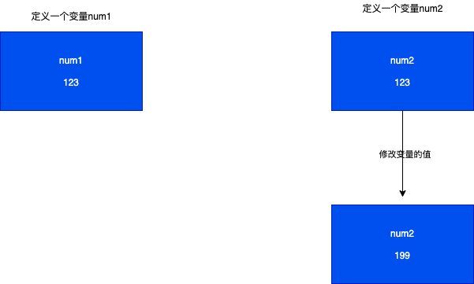

# 类和对象

在ES6之前如果定义一个类，需要通过构造函数的方式来定义一个函数。

从ES6开始系统提供了一个名称叫做class的关键字，这个关键字就是专门用于定义类的

```js

class Person{

    // 当通过new创建对象的时候，系统会自动调用constructor
    constructor(name,age){
        this.name = name
        this.age = age
    }
    
    // 实例属性
    name = 'test'

    age = 19

    // 实例方法
    say(){
        console.log(this.name,this.age)
    }

    // 静态属性
    static num = 12

    // 静态方法
    static run(){
        console.log('run')
    }
}

// 实例化
let p = new Person('test',12)
// 调用
console.log(p.name,p.age)
p.say()
// 调用静态方法和属性
console.log(Person.num)
Person.run()

```
上面的方式定义属性和方法，除了谷歌浏览器以外的其他的浏览器都会报错，应该采用下面的方式进行定义

```js

class Person{

    constructor(name,age){
        this.name = name
        this.age = age
        // 添加到自己上面
        this.say = function(){
            console.log("say")
        }
    }
    // 写在constructor之外的方法会被挂载到原型中
    test(){
        console.log('原型放阿飞')
    }
}

// 定义静态属性
Person.num = 99

```

在ES6标准中，不允许在类中定义静态方法，不能在类中定义静态属性

## 继承

```js

class Person{
    constructor(name,age){
        this.name = name

        this.age = age
    }

    say(){
        console.log(this.name,this.age)
    }
}


// 继承
class Stu extends Person{
    constructor(name,age,score){
        super(name,age)
        this.score = score
    }
}
```

## 获取对象类型


```js

let obj = new Object()

console.log(typeof obj) // object


let arr = new Array()

console.log(typeof arr) // object


```

如果通过构造函数来创建一个对象，本质还是通过`new Object()`来创建的


如何让其输出对应的对象信息

```js

console.log(arr.constructor.name) // Array

```

### instanceof关键字

instanceof用于判断对象是否是指定构造函数的实例

```js

class Person{
    name = "test"
}

let p = new Person()

console.log(p instanceof Person) // true

```

::: warning 注意点

只要构造函数的原型对象出现在实例对象的原型链中都会返回true

:::


### isPrototypeOf

用于判断一个对象是否是另一个对象的原型

```js

class Person(){
    name = "test"
}

let p = new Person()

console.log(Person.prototype.isPrototypeOf(p)) // true


class Cat {
    name = "mm"
}

console.log(Cat.prototype.isPrototypeOf(p)) // false


```

```js

function Person(name){
    this.name = name
}

function Stu(name,score){
    Person.call(this,name)
    this.score = score
}

Stu.prototype =new Person()

Stu.prototype.constructor = Stu

let stu = new Student()

console.log(Person.prototype.isPrototypeOf(stu)) // true

```

::: warning 注意点:

只要原型对象在实例对象的原型链中，就会返回true

:::

### 判断某一个对象是否拥有某一个属性

```js

class Person{
    name = null
    age = 0
}

// 原型对象挂载一个属性
Person.prototype.height = 0

let p = new Person();

console.log("name" in p) // true

console.log('width' in p) // false

// 只要类中或者原型对象中有，就返回true
console.log('height' in p) // true

```

###  如何判断一个对象本身是否存在某一个属性呢？

```js

let p = new Person()

// 判断当前的类中是否存在name属性
console.log(p.hasOwnProperty("name")) // true

// 判断当前对象中是否存在height，因为height被挂载到原型中，所以类中不存在，就会返回false
console.log(p.hasOwnProperty("height")) // false

```

## 对象增删改查

```js

class Person{

}

let p = new Person()

```

* 增

```js

// 增加属性
p.name = "test"
p['age'] = 18

// 增加方法

p.say = function(){
    console.log("ssss")
}

p['study'] = function(){
    console.log('day day up')
}

```

* 删


```js

// 删除属性
delete p.name

delete p['age']

// 删除方法
delete p.say

delete p['study']

```

* 改

```js

p.name = "change"

p['age'] = 99

p.say = function(){
    console.log('ss')
}

p['study'] = function(){
    console.log('study')
}

```

* 查


```js

console.log(p.name)

console.log(p['age'])

console.log(p.say)

console.log(p['study'])

```

## 对象遍历

在JS中通过高级for循环来遍历对象

```js

// 将指定的对象中所有的属性和方法的名称取出来，依次赋值给key这个变量
for(let key in obj){

}

```

::: warning 注意点：

在使用这个高级遍历的时候，在ES6中使用的类默认将方法挂载到原型上，所以`for in`无法遍历挂载到原型上的方法或属性

:::

## 对象的解构赋值

### 基础的结构赋值

对象的结构赋值中，左边的属性必须和右边的对象属性一致才可以

```js

let obj = {name:'test',age:19}

let {name,age} = obj;

```

### 应用场景

```js

let obj = {
    name:'test',
    age:12
}

function say({name,age}){
    console.log(name,age)
}

say(obj)

```

## 深拷贝和浅拷贝

### 深拷贝

修改新变量的值不会影响原有变量的值，默认情况下基本数据类型都是深拷贝

```js

let num1 = 123

let num2 = num1

num2 = 199

console.log(num1,num2) // 123 199

```




### 浅拷贝

修改新变量的值会影响原有变量的值，默认情况下引用类型都是浅拷贝

```js

class Person{
    name = 'test'
    age = 19
}

let p = new Person()

let n = p

n.name = 'sss'

console.log(p.name) // sss

console.log(n.name) // sss

```

当定义一个变量的new一个类的时候会开辟两个内存地址，
一个是变量的内存地址，另一个就是类的内存地址，
当真实赋值的时候，是将类的内存地址赋值给变量,如果在创建一个新的变量的然后将原来指向类的内存地址赋值给新变量，其内存地址指向的都是同一块，修改一个地方，会影响到其他的地方


### 对象的深拷贝

实现对象的深拷贝的方法`Object.assign(obj1,obj2)`

这个方法可以实现对象的深拷贝，将第二个对象的值赋值给第一个对象

```js

class Person{

    name = 'test'
    age = 17
}

let obj2 = new Person()

//定义一个对象

let obj1 = new Object()

// 深拷贝

Object.assign(obj1,obj2)

obj1.name = 'zs'

console.log(obj1.name) // zs

console.log(obj2.name) // test

```

::: warning 注意点：

上面的方法，如果拷贝的是基本数据类型，是可以实现的，但是无法实现非基本类型的数据

:::

```js

class Person{
    name = 'test'
    cat = {
        age:3
    }

    scores = [1,2,3]
}


let p1 = new Person()

let p2 = new Object()

depCopy(p1,p2)

function depCopy(target,source){
    // 1. 通过遍历拿到source中所有的属性对应的取值
    for(let key in source){
        // 2.取出当前遍历到的属性对应的取值
        let sourceValue = source[key]
        // 3.判断当前的取值是否引用数据类型
        if(sourceValue instanceof Object){
            console.log(sourceValue.constructor)
            console.log(new sourceValue.constructor)
            // 拿到对象的构造函数中的类型，并进行实例化操作，创建一个空对象
            let subTarget = new sourceValue.constructor;
            // 将空对象赋值给当前的key
            target[key] = subTarget
            // 递归执行当前对象的数据
            depCopy(subTarget,sourceValue)
        }else{
            target[key] = sourceValue
        }
    }
}

```
