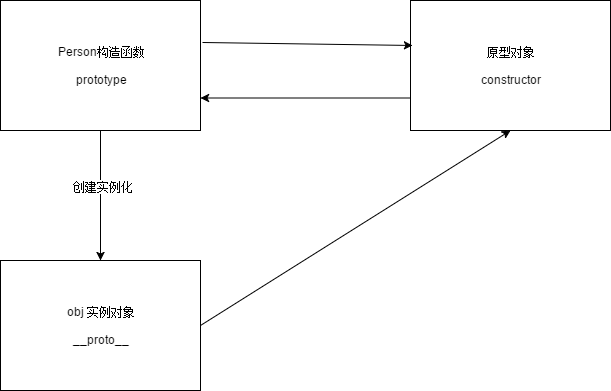
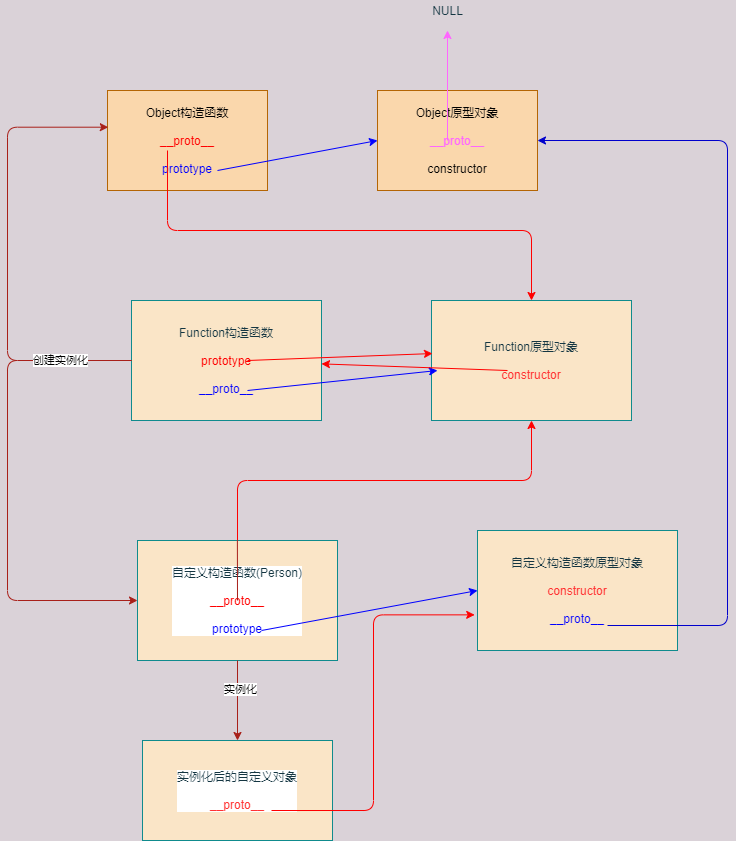

# JavaScript面向对象

## 面向对象与面向过程的区别

* 面向过程强调是功能行为
* 面向过程关注的是解决问题需要有哪些步骤
* 面向对象强调的是功能，关注的是解决问题需要哪些对象

## 对象创建

### 创建默认对象

JavaScript提供了一个默认的对象`Object`类

```js

// 1. 创建一个类：
let obj = new Object();
// 第二种创建方式 let obj = {};
// 2. 给对象添加属性
obj.name = "test"
obj.age = 12;
// 3. 添加行为
obj.say = function () {
    console.log("说话");
}
// 使用属性和行为
console.log(obj.name);
obj.say()

```

第三种方式

```js

let obj = {
    name: "test",
    age:12,
    say:function (){
        console.log("说话");
    }
}
```

**方法和函数的区别：**

* 方法不能直接被调用，函数可以，方法只能通过对象来调用
* 无论是方法还是函数，都有一个`this`。
  函数的`this`指向的是`window`，方法指向的是`obj`对象


什么是函数：

函数就是没有和其他的类绑定在一起的，我们就称之为函数

```js
// 函数可以直接调用
function test(){
    console.log("test")
}
test()
```

什么是方法：

函数和其他类绑定在一起，我们称之为方法

```js

let obj = {
    test:function (){
        console.log("test")
    }
}
// 方法不能直接调用
obj.test()

```

## 工厂函数

工厂函数就是专门创建对象的函数

```js

function createPerson(name,age){
    return {
        name,
        age,
        say:function (){
            console.log("hello")
        }
    }
}

let obj1 = createPerson("test",12);
let obj2 = createPerson("test1",22);
console.log(obj1,obj2)

```

## 构造函数

构造函数和工厂函数一样，都是专门创建对象的，

构造函数本质上是工厂函数的简写

构造函数和工厂函数的区别：
* 构造函数的函数名称首字母必须大写
* 构造函数只能够通过new来调用

```js

function Person(name,age){
    this.name = name
    this.age = age
    this.say = function () {
        console.log("hello")
    }
}
let obj1 = new Person("test",12);
let obj2 = new Person("test1",123);
console.log(obj1,obj2);

```

::: warning 注意点：

对于两个相同的方法，开辟了两个不同的存储空间，可能会出现性能的问题

解决办法：

1. 定义一个公共的函数，单独给当前的函数开辟一个内存空间
```js

function mySay() {
  console.log("hello")
}

function Person(name,age){
  this.name = name
  this.age = age
  this.say = mySay;
}

```
**但是当前这种方式是有弊端的：**
* 阅读性降低了
* 污染了全局的命名空间

2. 第二种方式
```js
let fns = {
    say:function (){
        console.log("hello")
    }
};
function Person(name,age){
  this.name = name
  this.age = age
  this.say = fns.say();
}

```

3. 第三种优化方式(js中最常用的方式，前面的两种方式只是演变的过程)

```js

function Person(name,age){
  this.name = name
  this.age = age
}
Person.prototype = {
    say:function (){
      console.log("hello")
    }
}

```

:::

### prototype特点

1. 存储在prototype中的方法被对应构造函数创建出来的所有对象共享
2. 在prototype中也能存储属性
3. prototype中出现了和构造函数中出现了同名的方法或者属性，对象在访问的时候，访问到的是构造函数中的数据

**应用场景：**

prototype中一般情况下用于存储所有对象都相同的一些属性以及方法，
如果是对象特有的属性和方法，我们会存储到构造函数中

### 对象的三角恋关系

1. 每个“构造函数”中都有一个默认的属性，叫做prototype
   prototype属性保存着一个对象，这个对象我们称之为“原型对象”
   
2. 每个“原型对象”中都有一个默认的属性，叫做constructor，
   其指向当前原型对象对应的那个“构造函数”
   
3. 通过构造函数创建出来的对象我们称之为“实例对象”
    每个“实例对象”中都有一个默认的属性，叫做__proto__
   其指向创建它的那个构造函数的“原型对象”

<a data-fancybox title="avatar" href="./images/gouzao.png"></a>

### 函数对象完整关系图

* Function函数是所有函数的祖先函数
* 所有构造函数都有一个prototype属性
* 所有原型对象都有一个constructor属性
* 所有函数都是对象
* 所有对象都有一个__proto__属性

<a data-fancybox title="完整的函数对象关系图" href="./images/all.dio.png"></a>

### 原型链

为了怒破坏原有的关系，在给prototype赋值的时候，需要在自定义的对象中手动添加一个constructor属性，并手动的指定需要指向谁

```js

function Person(){
    this.name = ''
    this.info = {}
}


Person.prototype = {
    // 手动指向需要指向的对象
    constructor:Person,
    say:function(){
        console.log('hello word')
    }
}

```

::: warning 原型链的整个流程

* 创建的*实例对象*中存在需要使用的*方法或者属性*的话，直接使用对象实例中的对象
* 如果对象中不存在当前的方法和属性会向上查询当前*构造函数*原型中是否存在要使用的*方法或者属性*
* 如果构造函数中不存在当前要使用的方法和属性，还会向上查询到*Object原型*中，是否存在当前的*方法或者属性*
* 如果Object原型中还不存在当前的方法和属性，就会报错

**注意点：**
    在给一个对象不存在的属性设置值的时候，不会去原型对象中查找，如果当前对象没有会就给当前对象新增一个不存在的属性
:::


## 面向对象的三大特性

### 封装性

默认情况下对象的属性和方法都是公开的，只要拿到对象就可以操作对象的属性和方法

由于构造函数也是一个函数，所以也会开启一个新的作用域

所以在构造函数中通过var/let定义的变量也是局部变量

所以在构造函数中定义的函数也是局部函数

```js

function Person(){
    // 私有变量
    let age = 34;
    // 公有的方法
    this.setAge = function(myAge){
        if(myAge > 0){
            age = myAge;
        }
    }
    // 获取数据
    this.getAge = function(){
        return age;
    }
}

```

* 隐藏对外部具体的实现细节，通过暴露的共有方法来设置指定的值

**私有属性注意点：**

在给一个对象不存在的属性设置值的时候，不会去原型对象中查找，
如果当前对象没有就会给当前对象新增一个不存在的属性。
由于私有属性的本质是一个局部变量，并不是真正的属性，
所以如果通过`obj.属性`的方式是找不到私有属性的，
所以会给当前对象*新增*一个不存在的属性


#### 属性和方法的分类

在JavaScript中属性和方法分为两类

* 实例属性/实例方法

在企业开发中通过实例对象调用的属性和方法称之为实例属性/方法

* 静态属性/静态方法

在企业开发中通过构造函数调用的属性和方法称之为静态属性/方法


### 继承性

* 继承中的第一种方式

在企业开发中，为了减少代码冗余度，就需要使用继承的方式来减少代码的冗余度


```js
// 定义一个公共的人
function Person(){
    this.name = ""
    this.age = null
    this.say = function(){
        console.log(this.name,this.age)
    }
}

// 定义一个学生的类，因为学生本身也是人，所以我们可以通过继承的方式来继承人
function Stu(){
    this.score = 0
    this.study = function(){
        console.log("day day up")
    }
}

// 更改学生上的原型对象
Stu.prototype = new Person()

Stu.prototype.constructor = Stu

let stu = new Stu()

stu.name = "test"
stu.age = 18
stu.score = 99

```

这种方式的弊端：

* 如果需要在初始化对象的时候进行赋值的话，在更改原型对象中，是找不到对应的属性和方法的

```js

function Person(name,age){
    this.name = name
    this.age = age
}

// name和age在学生对象中无法进行赋值操作,因为其是在后面修改原型对象中，将Stu默认的原型对象替换成Person的原型对象
function Stu(name,age,score){
    this.score = score
}


```

#### bind-call-apply

1. this 是什么

谁调用当前函数或者方法，this就是谁

2. bind-call-apply

这三个方法都是用于修改函数或者方法中的this
* bind方法的作用

修改函数或方法中的this为指定的对象，并返回一个修改之后的新函数给我们

注意点: bind方法除了可以修改this以外，还可以传递参数，只不过参数必须写在this对象的后面

```js

let obj = {
    name:'zs'
}
function test(){
    console.log(this)
}

let fn = test.bind(obj)

fn()

// 传参的方法
// let fn = test.bind(obj,var1,var2,...)

```

* call方法作用


```js
// 直接修改函数中的this为指定对象，并且直接调用修改之后的函数

test.call(obj)

// 传参
// test.call(obj,var1,var2,...)

```

* apply方法作用

```js

// 直接修改函数中的this为指定对象，并且直接调用修改之后的函数
test.apply(obj);

// 传参

// test.apply(obj,[var1,var2,...])

```

其中call和apply的区别：

传参的时候，call是直接后面跟参数并用逗号分隔开，而apply是通过第二个参数传入的数组，进行传递参数的

* 继承方式二

```js

function Person(name,age){
    this.name = name
    this.age = age
    this.say = function(){
        console.log(this.name,this.age)
    }
}

function Stu(name,age,score){
    Person.call(this,name,age);
    this.score = score
    this.study = function(){
        console.log("day day up")
    }
}

let stu = new Stu('zs',19,99)
console.log(stu.name,stu.age,stu.score)

```

 弊端：如果通过原型对象挂载一个属性/方法的话，通过`call`的方式无法获取到原型对象中的属性/方法

 ```js
// 访问不到这个原型对象挂载的方法
Person.prototype.say = function(){
    console.log("sss")
}

 ```

* 继承方式三

如何解决上边的弊端

要想使用Person原型对象中的属性和方法，那么就必须将Stu的原型对象改为Person的原型对象才可以

```js

function Person(name,age){
    this.name = name
    this.age = age
}

Person.prototype.say = function(){
    console.log(this.name,this.age)
}

function Stu(name,age,score){
    Person.call(this,name,age);
    // 将Stu的原型对象改为Person的原型对象
    Stu.prototype = Person.prototype
    // 再将原型的constructor改为Stu的constructor
    Stu.prototype.constructor = Stu
    this.score = score
    this.study = function(){
        console.log("day day up")
    }
}

let stu = new Stu('zs',19,99)
console.log(stu.name,stu.age,stu.score)

```

弊端：破坏了原型的三角恋的关系，并且父类的原型对象和子类的对象是同一个原型对象，如果给子类添加一个方法，父类也同时生效

* 继承方式四（终极）

```js

function Person(name,age){
    this.name = name
    this.age = age
}

Person.prototype.say = function(){
    console.log(this.name,this.age)
}

function Stu(name,age,score){
    Person.call(this,name,age);
    // 将Stu的原型对象改为Person实例对象
    Stu.prototype = new Person()
    // 再将原型的constructor改为Stu的constructor
    Stu.prototype.constructor = Stu
    this.score = score
    this.study = function(){
        console.log("day day up")
    }
}

let stu = new Stu('zs',19,99)
console.log(stu.name,stu.age,stu.score)

```

原理原型挂载到实例对象，并不会污染到父类的原型对象，如果添加一个新的方法和属性，会添加到实例对象中。

### 多态性

* 什么是强类型语言

一般编译型语言都是强类型语言，强类型语言，要求变量的使用要严格复合定义，例如：定义int num;那么num中将来只能存储整型数据

* 什么是弱类型语言

一般解释型语言都是弱类型语言，
弱类型语言不会要求变量的使用要严格符合定义，例如：定义let num;num中既可以存储整型，也可以存储布尔类型

* 由于js语言是弱类型语言，所以我们不用关注多态性


### 什么是多态？

事物的多种状态。同一个事件发生在不同的对象上会产生不同的结果

编程语言中的体现：

父类型变量保存了子类型对象，父类型变量当前保存的对象不同，产生的结果也不同
