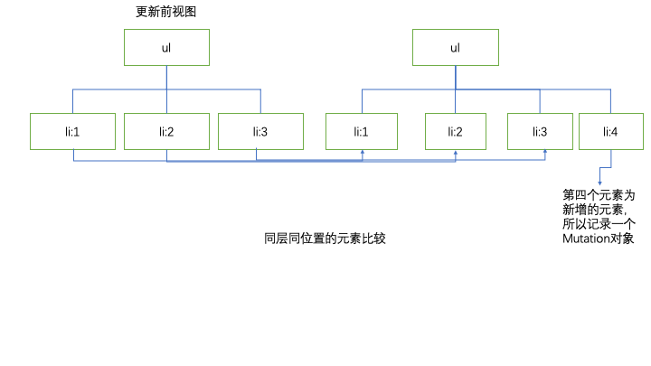

# 组件深入

## 生命周期

### 什么是生命周期？

事物从生到死的过程，我们称之为生命周期

### 什么是生命周期方法

事物从生到死的过程中，在特定时间节点调用的方法，我们称之为生命周期方法

### React组件生命周期方法

组件从生到死的过程，在特定的时间节点调用的方法，我们称之为组件的生命周期方法

- constructor生命周期的作用
    * 通过props接收父组件传递过来的数据
    * 通过this.state初始化内部的数据
    * 通过bind为时间绑定示例(this)
        this.myClick = this.btnClick.bind(this)
    
- render 生命周期的作用
    * 返回组件的结构

- componentDidMount 生命周期的作用
    * 依赖于DOM的操作可以在这里进行
    * 在这里发送网络请求（官方推荐）
    * 可以在此处添加一些订阅
    
- componentDidUpdate 生命周期的作用
    * 可以在此对更细之后的组件进行操作
    
- componentWillUnmount 生命周期的作用
    * 在此方法中执行必要的清理操作
    * 例如，清理定时器，取消或清除网络请求
    * 清理在componentDidMount()中创建的订阅

示例：

```jsx

import React from "react";
class Home extends React.Component{
    constructor(props) {
        super(props);
        console.log('挂载时 - 创建组件');
        this.state = {
            count:0
        }
    }
    render() {
        console.log('挂载时 - 渲染组件');
        return(
            <div>
                <p>Home</p>
                <p>{this.state.count}</p>
                <button onClick={()=>{this.btnClick()}}>按钮</button>
            </div>
        )
    }

    btnClick(){
        this.setState({
            count:1
        })
    }

    componentDidUpdate(prevProps, prevState, snapshot) {
        console.log('更新时-更新完成');
    }

    componentDidMount() {
        console.log('挂载时 - 渲染完成');
    }

    componentWillUnmount() {
        console.log('卸载时');
    }
}

class App extends React.Component{

    constructor(props) {
        super(props);
        this.state = {
            flag : true
        }
    }

    render() {
        return(
           <div>
               {this.state.flag && <Home />}
               <button onClick={()=>{this.btnClick()}}>点击</button>
           </div>
        )
    }

    btnClick(){
        this.setState({
            flag:!this.state.flag
        })
    }
}

export default App

```

### 生命周期的其他方法

* getDerivedStateFromProps 

会在调用 render 方法之前调用，
并且在初始挂载及后续更新时都会被调用。
它应返回一个对象来更新 state，如果返回 null 则不更新任何内容。

* shouldComponentUpdate

判断 React 组件的输出是否受当前 state 或 props 更改的影响

* getSnapshotBeforeUpdate

可以拿到最后更新之前的数据的地方

## diff算法

### React渲染流程

- 执行render方法

- 将JSX转换成createElement

- 执行createElement创建虚拟DOM，得到虚拟DOM树


### 组件更新流程

- props或state发生改变

- render方法重新执行

- 将JSX转换成createElement

- 利用createElement重新生成新的虚拟DOM树

- 新旧虚拟DOM通过diff算法进行比较

- 每发现一个不同就生成一个mutation

- 根据mutation更新真实DOM

### React-diff算法

- 只会比较同层的元素

- 在diff算法中，默认在同层比较的时候，只会同位置的比较

- 在diff算法中，如果比较的是相同类型的元素，那么就记录变化

- 在diff算法中，如果比较的是不同类型的元素，那么直接删除以前的，使用新的

- 在diff算法中，如果上一层是不同类型的元素，那么下一层不会进行比较，而是直接使用新的

## 列表渲染优化

在渲染列表的过程中，因为react的diff算法只会比较同层同位置的数据，所以在渲染列表的过程中，元素插入位置的不同，会导致一定的渲染问题

示例：

源数据：

```jsx

<ul>
    <li>1</li>
    <li>2</li>
    <li>3</li>
</ul>

```

在后面插入一个元素

```jsx

<ul>
    <li>1</li>
    <li>2</li>
    <li>3</li>
    <li>4</li>
</ul>

```

因为会对同层同位置的元素进行比较，所以比较的顺序如下



只会创建一个mutation对象

如果在前面插入一个元素

```jsx

<ul>
    <li>0</li>
    <li>1</li>
    <li>2</li>
    <li>3</li>
</ul>

```

同上会对同层同位置的元素进行比较，默认会创建四个mutation对象，这样会拖慢渲染性能

**如何解决当前性能的问题：**

给每个子结点一个特殊的key做标识，就可以实现如下代码:

```jsx

import React from "react";

class Home extends React.Component{
    constructor(props) {
        super(props);
        this.state = {
            arr:['鲁班','虞姬','火舞']
        }
    }
    render() {
        return(
            <div>
                <ul>
                    {
                        this.state.arr.map(v=>{
                            return(<li key={v}>{v}</li>)
                        })
                    }
                </ul>
            </div>
        )
    }

}
class App extends React.Component{
    constructor(props) {
        super(props);
    }

    render() {
        return(
          <div>
              <Home/>
          </div>
        )
    }
}
export default App

```

::: warning 注意点

**<span style="color:red">必须保证key是唯一的不然会报错</span>**

:::

## 组件性能优化

### 类组件性能优化

在只改变父组件的数据不改变子组件的数据的时候，不仅仅父组件会重新渲染，子组件也会跟着重新渲染，这样就会导致一定的性能问题。

解决方案：

让组件继承于PureComponent，让React自动帮助我们实现是否需要重新渲染数据

实现代码：

```jsx

import React from "react";

// class Home extends React.Component{
class Home extends React.PureComponent{
    constructor(props) {
        super(props);
        this.state = {
            arr:['鲁班','虞姬','火舞']
        }
    }
    render() {
        console.log("子组件render");
        return(
            <div>
                <ul>
                    {
                        this.state.arr.map(v=>{
                            return(<li key={v}>{v}</li>)
                        })
                    }
                </ul>
            </div>
        )
    }

}

class App extends React.Component{
    constructor(props) {
        super(props);
        this.state = {
            name:'test'
        }
    }

    render() {
        console.log("父组件render");
        return(
          <div>
              <p>{this.state.name}</p>
              <Home/>
              <button onClick={()=>{this.btnClick()}}>按钮</button>
          </div>
        )
    }

    btnClick(){
        this.setState({
            name:'sss'
        })
    }
}

export default App

```

### 函数式组件性能优化

- 没有继承关系

- 没有生命周期方法

那么如何优化函数式组件的性能问题呢?

在React中提供了一个函数方法`React.memo()`，这个方法，内部已经对组件的性能做了一定的优化

示例：

```jsx

import React from "react";

// function Home(){
//     console.log("子组件render");
//     return(
//         <div>
//             <p>Home</p>
//         </div>
//     )
// }

const PurHome = React.memo(function (){
    console.log("子组件render");
    return(
        <div>
            <p>Home</p>
        </div>
    )
})

class App extends React.Component{
    constructor(props) {
        super(props);
        this.state = {
            name:'test'
        }
    }

    render() {
        console.log("父组件render");
        return(
          <div>
              <p>{this.state.name}</p>
              <PurHome/>
              <button onClick={()=>{this.btnClick()}}>按钮</button>
          </div>
        )
    }

    btnClick(){
        this.setState({
            name:'sss'
        })
    }
}

export default App

```

### 性能优化注意点

* state注意点

永远不要直接修改state中的数据，更新数据必须要通过setState传递一个新的值。

造成的问题：

如果直接修改state中的值，然后再调用`setState(this.state)`，如果我们继承的是PureComponent，会造成界面永远无法更新的情况

示例：

```jsx
import React from "react";

class Home extends React.PureComponent{
    constructor(props) {
        super(props);
    }
    
    render() {
        console.log("子组件render");
        return(
            <div>
                <p>Home</p>
            </div>
        )
    }

}

class App extends React.Component{
    constructor(props) {
        super(props);
        this.state = {
            name:'test'
        }
    }

    render() {
        console.log("父组件render");
        return(
          <div>
              <p>{this.state.name}</p>
              <Home/>
              <button onClick={()=>{this.btnClick()}}>按钮</button>
          </div>
        )
    }

    shouldComponentUpdate(nextProps, nextState, nextContext) {
        console.log(this.state, nextState);// 值永远都是相同的不会更新界面
        if (this.state.name !== nextState.name){
            return true
        }
        return false
    }

    btnClick(){
        this.state.name = "newName";
        this.setState(this.state);
        // this.setState({
        //     name:'sss'
        // })
    }
}

export default App


```


## 组件的Ref

### 字符串（不推荐）

通过ref='字符串'再通过this.refs.字符串（这种方式将会被废弃，不推荐使用）

```jsx

import React from "react";

class App extends React.Component{
    constructor(props) {
        super(props);
        this.state = {
            name:'test'
        }
    }
    render() {
        return(
          <div>
              <p ref={'box'}>我是段落</p>
              <button onClick={()=>{this.btnClick()}}>按钮</button>
          </div>
        )
    }

    btnClick(){
        // 第一种方式能获取：通过字符串的方式即将被废弃，不推荐
        let Op = this.refs.box
        Op.innerHTML = "新的段落"
        console.log(Op);
    }
}

export default App

```


### 对象(推荐)

先通过`React.createRef()`创建一个对象，然后将这个对象传递给ref

```jsx

import React from "react";

class App extends React.Component{
    constructor(props) {
        super(props);
        this.state = {
            name:'test'
        }
        this.oPRef = React.createRef();
    }
    render() {
        return(
          <div>
              <p ref={this.oPRef}>我是段落</p>
              <button onClick={()=>{this.btnClick()}}>按钮</button>
          </div>
        )
    }

    btnClick(){
        // 使用对象的方式获取
        let oP = this.oPRef.current;
        oP.innerHTML = "对象设置新的值"
        console.log(oP);
    }
}

export default App

```

### 回调函数（推荐）

通过传递一个回调函数，然后保存回调函数参数的方式

```jsx

import React from "react";

class App extends React.Component{
    constructor(props) {
        super(props);
        this.state = {
            name:'test'
        }
        this.oPRef = null;
    }
    render() {
        return(
          <div>
              <p ref={(arg)=>{this.oPRef = arg}}>我是段落</p>
              <button onClick={()=>{this.btnClick()}}>按钮</button>
          </div>
        )
    }

    btnClick(){
        // 使用对象的方式获取
        let oP = this.oPRef;
        oP.innerHTML = "对象设置新的值"
        console.log(oP);
    }
}

export default App

```

::: warning 注意点

* 如果获取的是原生的元素，拿到的就是元素本身

* 如果获取的是类组件的元素，拿到的就是类组件的实例对象

* 如果获取的是函数组件元素，什么都拿不到

:::

### Ref转发

默认情况下通过ref是拿不到数据的，如果获取某一个元素的节点信息是可以实现的,通过`React.forwardRef()`高阶函数来创建一个组件

```jsx

import React from "react";

const About = React.forwardRef(function (props,myRef){
    return(
        <div ref={myRef}>
            <p>段落</p>
        </div>
    )
})

class App extends React.Component{
    constructor(props) {
        super(props);
        this.state = {
            name:'test'
        }
        this.oPRef = null;
        this.myRef = null;
    }
    render() {
        return(
          <div>
              <p ref={(arg)=>{this.oPRef = arg}}>我是段落</p>
              <button onClick={()=>{this.btnClick()}}>按钮</button>
              <About ref={(arg)=>{this.myRef = arg}}/>
          </div>
        )
    }

    btnClick(){
        // 使用对象的方式获取
        let oP = this.oPRef;
        oP.innerHTML = "对象设置新的值"
        console.log(oP);
    }
}

export default App

```

## 受控组件

值受到react控制的表单组件

```jsx

import React from "react";

class App extends React.Component{
    constructor(props) {
        super(props);
        this.state = {
            name:'test'
        }
    }
    render() {
        return(
          <form>
              <input type='text' value={this.state.name} onChange={(e)=>{this.change(e)}}/>
          </form>
        )
    }

    change(e){
        console.log(e.target.value);
        this.setState({
            name:e.target.value
        })
    }

}

export default App

```

其他受控组件地址：https://react.docschina.org/docs/forms.html

受控组件处理技巧，多个组件的处理：

如果处理多个组件，可能会产生很多的冗余代码,所以需要对代码进行优化处理

示例：

```jsx

import React from "react";

class App extends React.Component{
    constructor(props) {
        super(props);
        this.state = {
            name:'test',
            email:'aibayanyu@qq.com',
            phone:'13788889999'
        }
    }
    render() {
        return(
          <form>
              <input type='text' name={'name'} value={this.state.name} onChange={(e)=>{this.change(e)}}/>
              <input type='text' name={'email'} value={this.state.email} onChange={(e)=>{this.change(e)}}/>
              <input type='text' name={'phone'} value={this.state.phone} onChange={(e)=>{this.change(e)}}/>
          </form>
        )
    }
    change(e){
        this.setState({
            [e.target.name]:e.target.value
        })
    }
}

export default App

```

## 非受控组件

值不受到react控制的表单元素

示例：

```jsx

import React from "react";

class App extends React.Component{
    constructor(props) {
        super(props);
        this.myRef = React.createRef();
    }
    render() {
        return(
          <form onSubmit={(e)=>{this.submit(e)}}>
              <input type='text' ref={this.myRef}/>
              <input type='submit'/>
          </form>
        )
    }

    submit(e){
        e.preventDefault()
        console.log(this.myRef.current.value);
    }
}

export default App

```

## 高阶组件

参数为组件，返回值为新组件的函数

```jsx

import React from "react";

class Home extends React.PureComponent{
    render() {
        return(
            <div>
                Home
            </div>
        )
    }
}

function enhaceComponent(WrappedComponent) {
    class AdvComponent extends React.PureComponent{
        render() {
            return(
                <div>
                    <WrappedComponent />
                </div>
            )
        }
    }
    return AdvComponent;
}

const AdvComponent = enhaceComponent(Home)

class App extends React.PureComponent{
    render() {
        return(
          <div>
            <AdvComponent/>
          </div>
        )
    }
}

export default App

```

### 应用场景

* 增强Props，解决组件代码出现大量冗余的问题

示例：

```jsx

import React from "react";

// class Father1 extends React.PureComponent{
//     render() {
//         return(
//             <div>
//                 <Son1/>
//             </div>
//         )
//     }
// }
// class Father2 extends React.PureComponent{
//     render() {
//         return(
//             <div>
//                 <Son2/>
//             </div>
//         )
//     }
// }
//
// class Son1 extends React.PureComponent{
//     render() {
//         return(
//             <div>
//                 son1
//             </div>
//         )
//     }
// }
// class Son2 extends React.PureComponent{
//     render() {
//         return(
//             <div>
//                 son2
//             </div>
//         )
//     }
// }

const MyContext = React.createContext({})
const  { Provider,Consumer } = MyContext

class Son1 extends React.PureComponent{
    render() {
        return(
            <div>
                <p>{this.props.name}</p>
                <p>{this.props.age}</p>
            </div>
        )
    }
}

class Son2 extends React.PureComponent{
    render() {
        return(
            <div>
                <ul>
                    <li>{this.props.name}</li>
                    <li>{this.props.age}</li>
                </ul>
            </div>
        )
    }
}

function EnhancedComponent (WrappedComponent){
    class Father extends React.PureComponent{
        render() {
            return(
                <Consumer>
                    {
                        (value)=>{
                            return(
                                <WrappedComponent {...value} />
                               // <WrappedComponent name={value.name} age={value.age}/>
                            )
                        }
                    }
                </Consumer>
            )
        }
    }
    return Father;
}

const Father1 = EnhancedComponent(Son1);
const Father2 = EnhancedComponent(Son2);

class App extends React.PureComponent{
    render() {
        return(
          <Provider value={{name:'test',age:19}}>
              <Father1 />
              <Father2 />
          </Provider>
        )
    }
}

export default App

```

上面传的是相同的数据，如何传不同的数据

通过二次传递props的数据，修改代码如下所示

```jsx

<Provider value={{name:'test',age:19}}>
  <Father1 country={'中国'}/>
  <Father2 country={'韩国'}/>
</Provider>

```

```jsx

<WrappedComponent {...value} {...this.props} />

```

应用场景：

- 代码复用、增强Props、抽离State、生命周期拦截

抽离State和生命周期拦截示例：

```jsx

import React from "react";
import { EventEmitter } from "events"
const eventBus = new EventEmitter();

const MyContext = React.createContext({})
const  { Provider,Consumer } = MyContext

class Son1 extends React.PureComponent{
    render() {
        return(
            <div>
                <p>{this.props.name}</p>
                <p>{this.props.age}</p>
                <p>{this.props.country}</p>
                {
                    this.props.list.map(v=>{
                        return (<p>{v}</p>)
                    })
                }
            </div>
        )
    }
}

class Son2 extends React.PureComponent{
    render() {
        return(
            <div>
                <ul>
                    <li>{this.props.name}</li>
                    <li>{this.props.age}</li>
                    <li>{this.props.country}</li>
                    {
                        this.props.list.map(v=>{
                            return (<li>{v}</li>)
                        })
                    }
                </ul>
            </div>
        )
    }
}

function EnhancedComponent (WrappedComponent){
    class Father extends React.PureComponent{
        constructor(props) {
            super(props);
            this.state = {
                list:[]
            }
        }

        componentDidMount() {
            eventBus.addListener('update',this.update.bind(this))
        }

        componentWillUnmount() {
            eventBus.removeListener('update',this.update.bind(this))
        }

        update(list){
            this.setState({
                list:list
            })
        }
        render() {
            return(
                <Consumer>
                    {
                        (value)=>{
                            return(
                                <WrappedComponent {...value} {...this.props} {...this.state} />
                            )
                        }
                    }
                </Consumer>
            )
        }
    }
    return Father;
}

const Father1 = EnhancedComponent(Son1);
const Father2 = EnhancedComponent(Son2);

class App extends React.PureComponent{
    render() {
        return(
          <Provider value={{name:'test',age:19}}>
              <Father1 country={'中国'}/>
              <Father2 country={'韩国'}/>
              <button onClick={()=>{this.btnClick()}}>按钮</button>
          </Provider>
        )
    }

    btnClick(){
        eventBus.emit('update',['鲁班','虞姬'])
    }
}

export default App

```

应用场景：

权限控制

这是一个简单权限控制的界面，后面会有高级应用权限控制的方式和方法

示例：

```jsx

import React from "react";

class Login extends React.PureComponent{
    render() {
        return(
            <div>
                登录页面
            </div>
        )
    }
}

class Info extends React.PureComponent{
    render() {
        return(
            <div>
                用户信息界面
            </div>
        )
    }
}

function EnhancedComponent(WrappedComponent){
    class Author extends React.PureComponent{
        render() {
            if (this.props.isLogin){
                return <WrappedComponent />
            }else {
                return <Login/>
            }
        }
    }

    return Author;
}

const AuthorInfo = EnhancedComponent(Info);

class App extends React.PureComponent{
    render() {
        return(
            <AuthorInfo isLogin={true}/>
        )
    }
}

export default App

```

## 其他内容

### Portals

默认情况下，所有的组件都是渲染到root元素中的，而Portals提供了一种将组件渲染到其他元素中的能力

在index.html文件中添加如下的代码

```html

<!DOCTYPE html>
<html lang="en">
  <head>
    <meta charset="utf-8" />
    <link rel="icon" href="%PUBLIC_URL%/favicon.ico" />
    <meta name="viewport" content="width=device-width, initial-scale=1" />
    <meta name="theme-color" content="#000000" />
    <meta
      name="description"
      content="Web site created using create-react-app"
    />
  </head>
  <body>
    <div id="root"></div>
    <div id="other"></div>
  </body>
</html>

```

```jsx

import React from "react";
import ReactDOM from 'react-dom'

class Model extends React.PureComponent{
    render() {
        // this.props.children: 可以获取当前组件所有的子元素或者子组件
        // 接收两个参数
        // 第一个参数：需要渲染的内容
        // 第二个参数：渲染到什么地方
        return ReactDOM.createPortal(this.props.children,document.getElementById("other"))
    }
}

class App extends React.PureComponent{
    render() {
        return(
            <div id={'app'}>
                <Model>
                    <div id={'model'}>
                        Model
                    </div>
                </Model>
            </div>
        )
    }
}

export default App

```

### Fragment

解决多层嵌套多余的问题，如果出现如下的多层嵌套的问题

```html

<div id='root'>
    <div id='app'>
        <div id='home'>
            <p>内容</p>
        </div>
    </div>
</div>

```

有结构可以看出 `app` 和 `home` 是多余的，所以这时候，需要我们使用`Fragment`来解决这个问题

```jsx

import React from "react";
const { Fragment } = React
class Home extends React.PureComponent{
    constructor(props) {
        super(props);
        this.state = {
            heroList:[
                '鲁班','虞姬','黄忠'
            ]
        }
    }
    render() {
        return(
            // 如果组件的结构比较复杂，那么只能有一个根元素
            <Fragment>
                <p>{this.state.heroList[0]}</p>
                <p>{this.state.heroList[1]}</p>
                <p>{this.state.heroList[2]}</p>
            </Fragment>
        )
    }

}

class App extends React.PureComponent{
    render() {
        return(
            // <Fragment id={'app'}>
            //     <Home/>
            // </Fragment>
            // 语法糖:这种写法是上面的写法的语法糖，如果需要给Fragment添加key，那么就不能使用语法糖
            <>
                <Home/>
                
            </>
        )
    }
}

export default App

```

### StrictMode

* 什么是StrictMode

开启严格模式，检查后代组件中是否存在潜在的问题

::: tip 

* 和Fragment一样，StrictMode不会渲染任何UI元素
* 仅在'开发模式'下有效

:::

`index.js`

```jsx

import ReactDom from "react-dom"
import React from "react";
import App from "./App";
ReactDom.render(
    <React.StrictMode>
        <App/>
    </React.StrictMode>
    ,document.getElementById("root"));

```


* 主要检查什么？

* 检查过时或废弃的属性/方法/...

* 检查意外的副作用
    * 这个组件的constructor会被调用两次
    * 检查这里写的代码逻辑被调用多次时，是否会产生一些副作用
