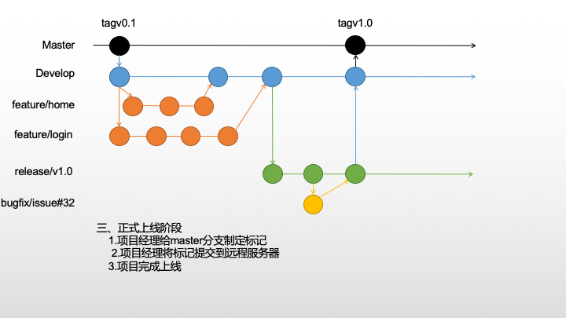

# gitflow开发工作流

在使用Git的过程中如果没有清晰流程和规划，否则,每个人都提交一堆杂乱无章的commit,项目很快就会变得难以协调和维护。
Git版本管理同样需要一个清晰的流程和规范。

## 规范

* master 用于保存上线的代码

* Develop 用于保存相对稳定代码，所有的feature分支都是通过该分支创建

* feature 用于开发新的功能分支， 不同的功能应创建不同的功能分支

* release 用于代码上线前准备（测试、文档完善、bug修复）该分支基于Develop分支创建 ---- 完善后直接提交至master

* bugfix 用于修复不紧急的bug 一般基于release创建，测试过程中出现的bug

* hotfix 用于需要紧急修复的bug 一般基于master创建，线上bug需要立即修复

