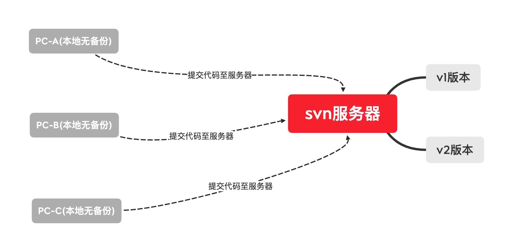
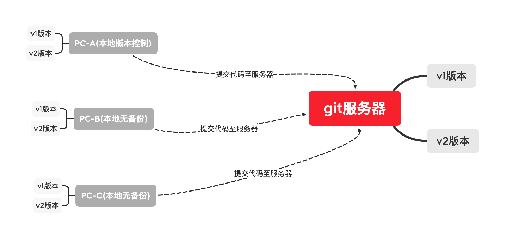
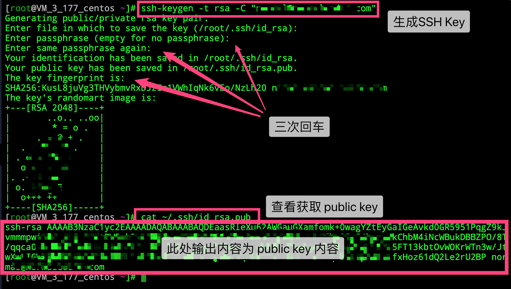
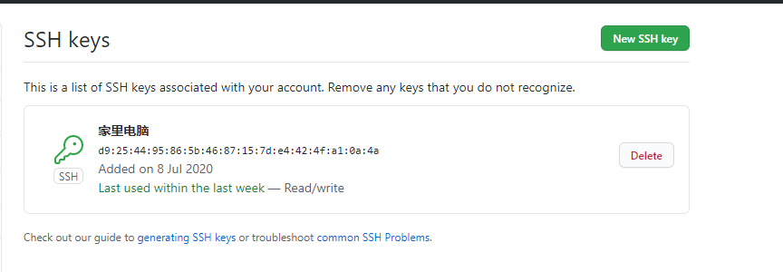
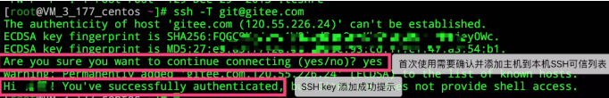

# 简介

## 常用的版本控制工具

1. CVS版本控制工具（古老的版本控制工具已被彻底代替）

2. SVN版本控制工具（集中式版本控制之王CVS的升级版）

3. Git版本控制工具（分布式版本控制之王）

## 解决的问题

1. 多个版本备份困难，浪费时间和空间
2. 恢复至以前的版本困难
3. 难以解决在多人开发中出现的代码冲突的问题
4. 难以追溯问题代码的人和时间
5. 无法进行版本控制
6. 项目版本发布困难

## 使用版本控制开发的好处

* 不会对现有工作造成任何损害
* 不会增加工作量
* 添加新的功能拓展时候，变得更加容易

## 分布式和集中式

### 集中式开发(SVN典型)

* 只有一台版本控制服务器，所有人的代码全部提交至这台服务器上。
* 如果网络出现问题代码将不能被提交
* 集中式开发安全性能高
* 老版本的svn会对每个子集目录创建一个.svn文件夹

<a data-fancybox title="avatar" href="./jizhongshi.png"></a>

### 分布式开发(Git典型)

* 本地也存在版本的控制
* 不联网的情况下，也可以同步至本地的版本库
* 多人开发版本控制更方便
* git只会在根目录创建一个.git文件夹

<a data-fancybox title="avatar" href="./fenbushi.png"></a>

### 区别

1. 集中式开发，代码只能提交至服务器，分布式下开发者可以提交代码至本地

2. 集中式开发，只有远程服务器有代码数据库，分布式下每个开发者机器都有一个代码数据库

3. 速度上：git的速度远比svn快

4. 结构上：git是分布式,svn是集中式

5. svn使用分支比较笨拙，git可以无限分支且灵活

6. svn必须联网，或者与svn服务器在同一网络下，git因为本地存在版本控制库，可以不联网提交至本地库

7. svn旧版本的在每个目录都放一个.svn文件，而git只在项目根目录存放一个.git文件夹

## 配置ssh

### 1、生成一个SSHkey

> 打开一个命令行工具输入如下命令

```shell
ssh-keygen -t rsa -C "你的git邮箱" 
```

> 根据提示完成三次回车，即可生成一个ssh key

### 2、查看public key

> 使用命令行输入如下命令

```shell
cat ~/.ssh/id_rsa.pub
```

<a data-fancybox title="公钥图片" href="./image/170141_5aa5bc98_551147.png"></a>

### 3、复制SSH key

#### gitee

> 通过仓库主页 **「管理」->「部署公钥管理」->「添加部署公钥」** ，添加生成的 public key 添加到仓库中。

<a data-fancybox title="gitee" href="./image/233212_29a62378_551147.png"></a>

> 添加后，在终端输入

```shell
ssh -T git@gitee.com
```

#### github

> 通过仓库主页 **「Setting」->「SSH and GPG keys」->「New SSH key」** ，将public key添加至仓库中


<a data-fancybox title="image-20200708074224472" href="./image/image-20200708074224472.png"></a>

> 添加后在终端输入

```shell
ssh -T git@github.com
```


---


### 共通

> 首次使用需要确认并添加主机到本机SSH可信列表。若返回 `Hi XXX! You've successfully authenticated, but Gitee.com does not provide shell access.` 内容，则证明添加成功。

<a data-fancybox title="chenggong" href="./image/jianchagitshifouchenggong.png"></a>

> 添加成功后，就可以使用SSH协议对仓库进行操作了。
