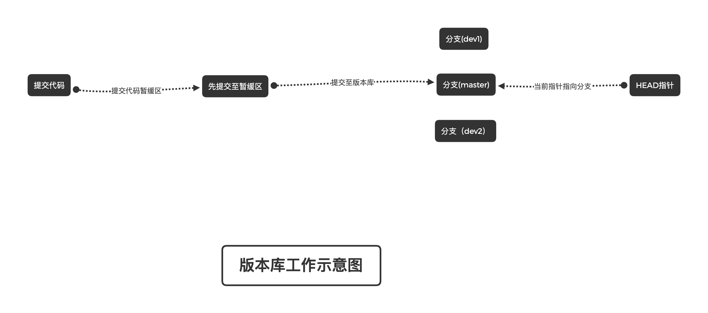

# 使用

配置ssh：[小窝地址](http://www.28yanyu.cn/index.php/archives/18/ "配置ssh")

git中的工作原理：

* .git目录用于存储记录版本信息 --- 版本库

* 版本库中存在暂缓区(stage)

* 版本库中的分支(master —— git自动创建的第一个分支)

* 版本库中的HEAD指针：用于只指向当前操作的分支

## 个人开发使用git

1. 初始化git

`git init`

2. 查看当前git的配置
 
`git config -l`

3. 配置当前使用git的用户（必须要进行配置）

`git config user.name "aibayanyu"`

`git config user.email "aibayanyu@qq.com"`
 
* 这个是必须要进行配置的，代码可以追溯到是哪个人进行操作的
 
4. 查看当前文件的状态（是否对文件进行修改）
 
`git status`
 
5. 提交代码至暂缓区
 
`git add .`
 
6. 提交代码至指定的分支
 
`git commit -m"提交代码的备注"`
 
7. 提交代码至服务器
 
`git push`
 

## 多人开发使用git（单分支）

 1. 初始化git
 
 `git init`
 
 2. 查看当前git的配置
  
 `git config -l`
 
 3. 配置当前使用git的用户（必须要进行配置）
 
 `git config user.name "aibayanyu"`
 
 `git config user.email "aibayanyu@qq.com"`
  
 * 这个是必须要进行配置的，代码可以追溯到是哪个人进行操作的
  
 4. 查看当前文件的状态（是否对文件进行修改）
  
 `git status`
  
 5. 提交代码至暂缓区
  
 `git add .`
  
 6. 提交代码至指定的分支
  
 `git commit -m"提交代码的备注"`
  
 7. 拉取服务器代码
 
 `git pull`
 
 * 如果拉取代码成功，如果改动了同一行代码，需要解决冲突，解决完冲突后在进行提交一次代码，再提交至服务器
 
 8. 提交代码至服务器
  
 `git push`
 
## 分支操作

* 查看分支数

    * 查看本地分支
    `git branch` 如果无分支，不返回数据
    * 查看远程分支
    `git branch -r`

* 创建一个分支
    
    * 创建分支
    `git branch 分支名称` 当前是在哪个分支下，新创建的分支会继承当前分支的所有内容，且每个分支都是相互独立的
    * 将分支提交至服务器
        * 切换至新创建的分支
        `git switch 分支名称` 如果提示切换失败，直接复制提示的切换分支的代码即可
        * 提交分支至服务器
        `git push`

* 删除一个分支
    * 本地删除
    `git branch -d 分支名称` 需要在其他分支下删除当前的分支，不然无法删除
    * 远程删除分支
    `git push origin --delete 分支名称`
    
* 合并分支
    * 切换到需要合并到哪个分支中
    `git switch 需要合并到的分支`
    * 合并分支
    `git merge 要合并至当前分支的名称`

## 标记

* 打标记

`git tag -a v0.1 -m"我是发布的第一个版本"`

* 提交至服务器

`git push origin v0.1`

* 查看标记

`git tag`

* 查看标记日志

`git show v0.1`

* 删除本地以及远程标记

    * 本地删除
    `git tag -d v0.1`
    * 删除远程
    `git push origin :refs/tags/v0.1`
    
