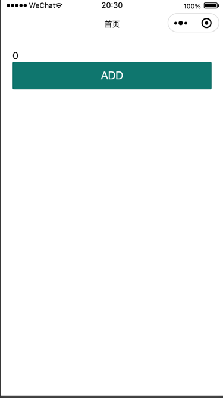

# taro安装和项目搭建


## taro安装

本次我们使用的`taro`版本是`3.4.x`，所以大家在安装的时候也需要使用`3.4.x`以及以上版本。

简单说一下我本地使用的环境配置：

```
taro@3.4.x
yarn@1.22.18
node@v16.14.2
npm@8.6.0
```

我们尽量保证我们的环境一致，如果环境不一致，可能会导致一些未知的问题，请大家自行更新环境。


那么接下来我们一起来安装一下`taro-cli`


我们找到官方文档地址：

[安装以及使用](https://taro-docs.jd.com/taro/docs/GETTING-STARTED)

````shell
# 直接安装默认是最新的版本
npm i -g @tarojs/cli

# 如果环境不一致，我们可以指定版本安装
npm i -g @tarojs/cli@3.4.12

````

### 安装完成以后我们查看一下我们当前的版本信息


```shell
taro -v

# 我们看到如下版本信息：
# 👽 Taro v3.4.12
# 3.4.12
# 证明我们已经安装成功了
```


## 安装`degit`

我们本地开发会使用一套基础的`taro`的模板去开发，所以我们需要安装一个`degit`的插件，这个插件可以帮我们快速的创建一个项目。

```shell
# 全局安装degit
npm  i -g degit
```

## 创建项目


接下来我们就需要拉取一份模板进行开发。

模板地址：[taro-vue3-starter](https://github.com/mistjs/taro-vue3-starter.git)

这套模板中，已经帮我们配置好了一些项目中常用的工具不需要我们再手动配置了。

我们通过degit去创建一个我们自己的项目。

```shell
# 创建一个项目
degit mistjs/taro-vue3-starter shopping-mini

```

:::tip 注意

如果你的电脑不足以支撑你访问github,那么我们可以通过我们的私有库地址直接下载一份源码即可

源码地址：[taro-vue3-starter](https://git.28yanyu.cn/yanyu/taro-vue3-starter)

:::


## 安装依赖

后续我们会使用yarn作为我们项目的包管理工具去开发。

```shell
# 安装依赖
yarn
# 启动项目
yarn dev:weapp
```

我们打开微信小程序：

1. 项目名称：shopping-mini（大家可以自定义）
2. 目录：这里我们需要选到我们项目中编译出来的`dist`文件夹目录。
3. AppId我们先生成一个测试号，进行测试。
4. 我们复制测试号，修改我们现在项目中的appid为，我们生成的测试号。

当我们看到如下：



代表我们的项目创建成功了
